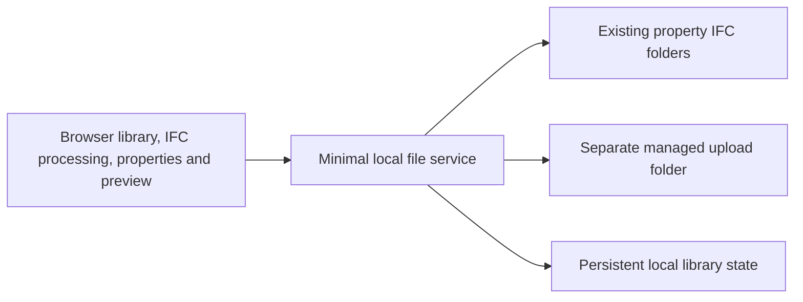

# Web asset browser architecture

MVP scope agreed by the user on 2026-10-05. This document supersedes the initial broader architecture proposal. The local React catalog, browser IFC worker, representative That Open viewer, and persistent Node file service are implemented. The production build was verified locally; no remote deployment is required. See [verification.md](verification.md).

## Agreed architecture

A React browser UI performs asset-type organization and property inspection. A dedicated web-ifc worker parses IFC and extracts representative element geometry through `GetFlatMesh`. That Open Components provides the viewer world and camera; Three.js renders the extracted meshes. The MVP does not convert the full building into Fragments. A minimal local file service lists existing IFC sources, stores uploads separately, serves model files, and persists library state.

| Part | Responsibility |
| --- | --- |
| Browser UI | Library/category/type navigation, uploads, processing status, removal, properties and preview. |
| Browser IFC processing | Read instance/type property sets and relationships, apply classification precedence, group occurrences, and prepare representative geometry. |
| Local file service | List configured sources, read IFC files, save uploads, and persist visibility and source identities. |
| Existing IFC folders | Supply initial saved models without being reorganized or overwritten. |
| Managed upload folder | Retain new uploads independently of existing model organization. |
| Persistent library state | Record model identity, source references, and hidden-model state across sessions. |

The framework, persistence format, cache strategy, and file-transfer details are implementation choices. A full relational catalog database is unnecessary for the agreed MVP. Keep file access separate from IFC interpretation so storage can be replaced later.

## Model and type identity

The source model is distinct from its asset types and their element occurrences. Group cards by stable model identity and IFC type GlobalId. Type names are labels; similarly named types in different models remain separate.

Associate generated data with the source fingerprint/revision so changed files cannot silently reuse stale properties or previews. Initial category extraction uses `Identity Data / Generic Hard Asset`, with the element value taking precedence whenever present and type fallback only when absent. Effective blank or `NA` classifications are excluded and counted.

## Persistence and removal

Read the existing `PROPERTIES/<CODE>/IFC/` sources. Store new uploads in a separate managed folder. The service persists library identities and hidden-model state. Removing a model hides its cards while retaining its IFC file.

The local service should bind to the local computer and expose configured library operations rather than arbitrary filesystem access. Validate upload names and destinations. These are implementation recommendations for the chosen local architecture, not an added enterprise authentication project.

## Verified feasibility and limits

BS19, approximately 117 MiB, is the verified processing and rendering target. Chrome runs produced 1,019 types and 107 categories. Its Airthings sensor preview rendered two meshes and 954 triangles with corresponding properties, in both the side inspector and centered dialog. Measured indexing runs took 13–21 seconds on the development computer. See [verification.md](verification.md) for test revisions, memory samples, screenshots and limitations.

Cached catalogs display immediately, but first inspection still opens and parses the source in the worker. Each preview shows one representative occurrence of the selected type. The larger HG62 model and arbitrary IFC exporters remain unverified.

If browser processing is unsuitable, bring the measured result back before changing the agreed architecture. Moving heavy processing into the local service would be a scope/design adjustment. Do not assume BS19 or the larger HG62 will work merely because their metadata relationships are valid.

## Deferred technology and integration

That Open distinguishes Engine/Fragments BIM libraries from its commercial Platform operational offering. The MVP uses the libraries; it does not depend on a verified commercial Platform backend contract. [Official product overview](https://thatopen.com/bim-software-open-source/), [Fragments repository](https://github.com/ThatOpen/engine_fragment).

Nucleus is a candidate future storage provider. Its documented file collaboration, search, tags, and supported-format thumbnails do not require adopting it for this local MVP. [Nucleus architecture](https://docs.omniverse.nvidia.com/nucleus/latest/architecture.html).

If Nucleus is revisited, evaluate Enterprise availability, licensing, supported client access, and authorization mapping. Nucleus Workstation was deprecated on 2025-10-01. [NVIDIA migration guidance](https://developer.nvidia.com/omniverse/legacy-tools), [Enterprise Nucleus](https://docs.omniverse.nvidia.com/nucleus/latest/enterprise.html).

FM import is deferred. Preserve identifiable model/type/occurrence records so a future interface can be defined, but build no FM connector, ticket workflow, asset-selection integration, or placement behavior now.

The earlier technology research remains supporting evidence, not a requirement to adopt its broader catalog backend recommendation. See [technology-research.md](technology-research.md) and the agreed [requirements](requirements-review.md).
