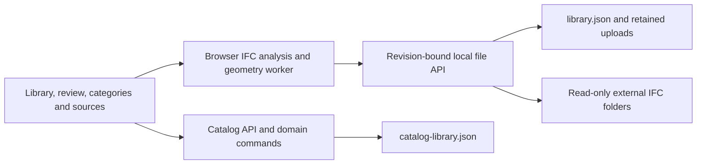

# Curated asset library architecture

The 2026-10-06 curated catalog replaces source-model cards as the main browsing identity. It retains the existing local file service, browser IFC worker and representative viewer. [Requirements](requirements-review.md) and the [design](superpowers/specs/2026-10-06-curated-asset-library-design.md) define the approved scope.

| Owner | Responsibility |
| --- | --- |
| `shared/catalog-library.ts` | Zod contracts, independent entry UUIDs, observations, reference memberships and command union. |
| Shared catalog domain modules | Normalization, suggestion filtering, publication rules, duplicate differences, import, merge and variant partitioning. |
| `server/catalog-library-store.ts` and routes | Complete catalog reads, validated commands, current-source verification and serialized atomic revision writes. |
| `src/catalog/` | Authoring, approval/filtering, revision races, stale-response rejection and reviewed geometry references. |
| Existing IFC worker/reader | Index classified occurrences, compact reusable observations by distinct values/memberships, and extract selected-occurrence geometry/raw properties. |
| Existing source service/workspace | Discover originals, retain uploads, indexes and hide state, and serve revision-bound IFC bytes. |
| AssetInspector/That Open/Three | Side or centered representative viewing, raw read-only property panels and resource disposal. |

## Data and command boundaries

`library.json` retains its existing structure. `catalog-library.json` schema version 1 contains a monotonically increasing revision, categories/templates, source observations and entries. Entries keep curated overrides separate from raw/normalized observations and source references. Source IDs and type GlobalIds identify evidence; entry UUIDs identify reusable definitions.

Catalog API is `GET /api/catalog-library` and `POST /api/catalog-library/commands`. Every command carries `expectedRevision`; conflicts return structured HTTP 409 and the UI refreshes without replay. Commands are import, edit, approve, archive, restore, merge, split, category and template. Zod validates each boundary. The source service validates visible current fingerprints/types/memberships when references are confirmed.

Imports create drafts and suggestions. Template mappings and product identity require staff confirmation. Publication rejects incomplete entries atomically, including batches. Split uses confirmed variant keys and exact occurrence memberships; merge retains target values and returns to draft. Same names produce comparison evidence, never automatic merges.

Writes are serialized and atomically renamed inside a single process. Use one service per data folder. Local host/origin checks apply to both APIs. The 32 MiB JSON request limit also applies to analysis snapshots. API reads and mutations currently return the full catalog, with no paging or delta protocol.

## Geometry and source changes

The source fingerprint is size plus modification time, not a hash. Worker downloads and indexes remain revision-bound. Same-fingerprint imports are idempotent. Changed observations preserve definitions/overrides and flag review; previews never silently rebind changed type identity or occurrence membership.

Preview selects the reviewed preferred occurrence and then explicitly equivalent references only. It rechecks current visible inventory and the worker-opened source. Hiding a source preserves catalog definitions, but removes its geometry availability. Source errors and viewer recovery remain local to the selected definition. Dedicated analysis and preview workers have separate cancellation/disposal ownership.

The inspector puts curated parameters first, then representative geometry and source provenance. Its side panel stacks geometry and raw properties at narrow width; the wider centered dialog can use columns. Native dialog Escape returns focus to the opener without side-inspector cleanup stealing it.

## Measured limits

Real BS19/JV3 analysis yielded 1,570 drafts, 152 labels and snapshots of about 20.0/9.3 MB. Pretty-printed persistent state was about 72 MB. Full-state JSON, schema validation, unvirtualized review cards and occurrence-membership comparisons are potential scaling costs. Filtered review is functional, while opening the full list exceeded the five-second CLI click budget on this machine. These observations are not a general throughput/memory benchmark.

Geometry loads for one representative occurrence, without full-building Fragments conversion. The viewer SDK remains a large lazy chunk. Unsupported units remain explicit; quantity expansion/exporter coverage and HG62-scale memory remain unverified. FM, placement, IFC editing, RFA, Nucleus and commercial Platform integration remain deferred. [Verification](verification.md) separates current catalog evidence from historical source-browser measurements.
